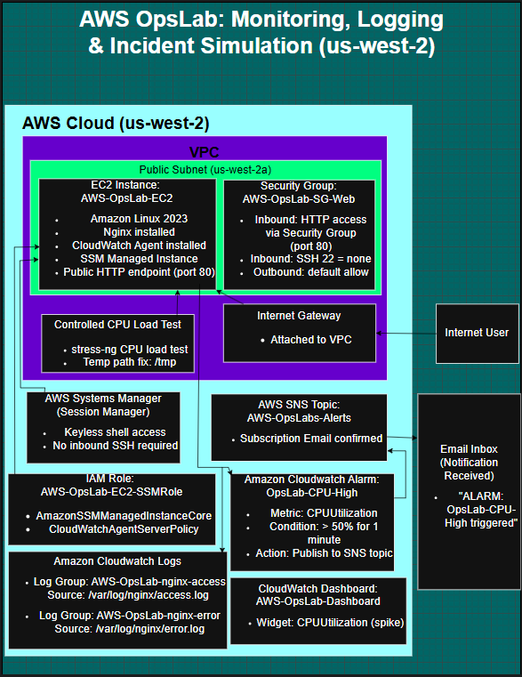

# AWS OpsLab (Monitoring + Incident Response)

OpsLab is a hands-on AWS operations project that demonstrates secure access to EC2 **without SSH**, centralized logging, monitoring/alerting, and an incident-response workflow validated through a controlled CPU stress test.

## Architecture

EC2 (Nginx) + CloudWatch Agent + SSM Session Manager  
→ CloudWatch Logs (nginx access/error)  
→ CloudWatch Alarm (CPUUtilization)  
→ SNS Topic → Email notification

**Diagram**
- 

## AWS Resources (as deployed)

**Region:** us-west-2

### EC2
- **Instance:** AWS-OpsLab-EC2
- **OS:** Amazon Linux 2023
- **Web server:** Nginx

### Secure access (no inbound SSH)
- Access via **AWS Systems Manager Session Manager (SSM)**

### CloudWatch Logs (centralized Nginx logs)
- **Log group:** AWS-OpsLab-nginx-access  
  - Source: `/var/log/nginx/access.log`
- **Log group:** AWS-OpsLab-nginx-error  
  - Source: `/var/log/nginx/error.log`

### CloudWatch Monitoring
- **Dashboard:** AWS-OpsLab-Dashboard
- **Alarm:** OpsLab-CPU-High  
  - Metric: CPUUtilization  
  - Threshold: > 50% for 1 minute  
  - Action: SNS publish → email notification  

### SNS
- **Topic:** AWS-OpsLab-Alerts
- **Subscription:** email (confirmed)

### IAM (instance role)
- **Role:** AWS-OpsLab-EC2-SSMRole
- **Policies:**
  - AmazonSSMManagedInstanceCore
  - CloudWatchAgentServerPolicy

## Incident Simulation (Proof of Monitoring)

To validate alerting end-to-end, a controlled CPU stress test was performed using `stress-ng`.

High-level flow:
1) Start CPU load test  
2) Alarm enters **ALARM** state and emails via SNS  
3) Confirm CPU graph spike and alarm state  
4) Stop load test  
5) Alarm returns to **OK**

## Runbook

See: `RUNBOOK.md`

## Commands

See: `examples/commands.md`

## Screenshots (evidence)

All screenshots live in `screenshots/`:

- `01-ec2-instance.png`
- `02-ssm-session.png`
- `03-nginx-status.png`
- `05-log-groups.png`
- `08-dashboard.png`
- `09-alarm-config.png`
- `11-sns-email.png`

## Teardown / Cost Control

See: `teardown.md`